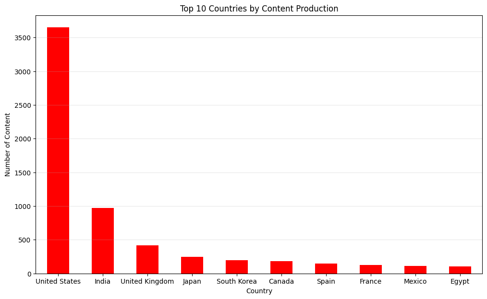
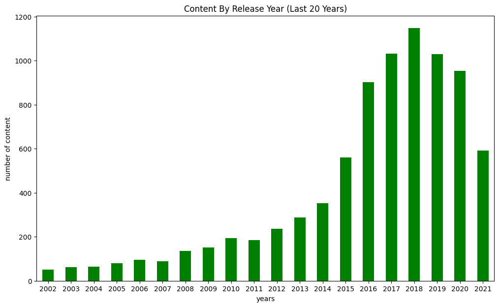
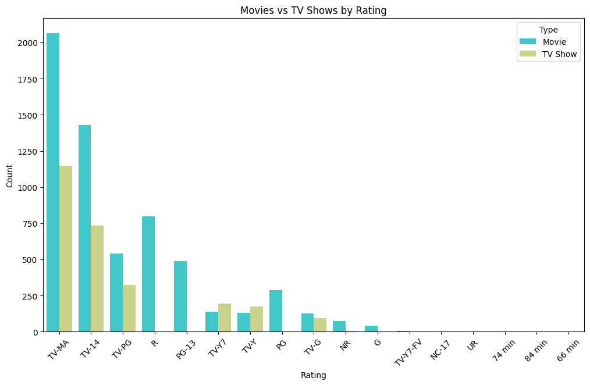
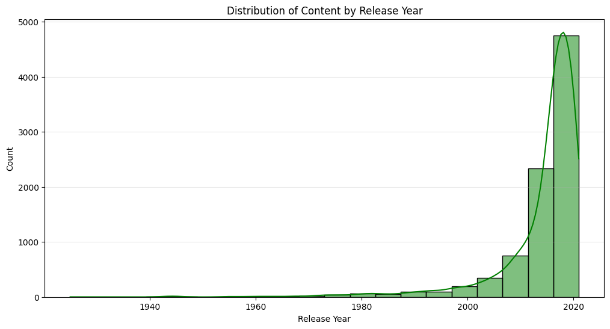

# Netflix Dataset Pipeline 🎬


Welcome to the **Netflix Dataset Pipeline**! This project provides a simple yet effective data analysis pipeline for exploring Netflix's catalog of movies and TV shows. The analysis is done using a Python-based Jupyter Notebook.

## 📌 Project Overview
This repository contains a data pipeline and analysis workflow aimed at uncovering insights from the `netflix_titles.csv` dataset. By leveraging popular data science libraries, we clean, process, and visualize the data to understand the content distribution across Netflix.

## 🛠️ Tech Stack
* **Language:** Python 3
* **Libraries:** `pandas`, `numpy`, `matplotlib`, `seaborn`, `plotly`
* **Environment:** Jupyter Notebook / Google Colab

## 📂 Repository Contents
* `netflix_analysis.ipynb`: The main notebook where all the data processing and analysis take place.
* `images/`: Contains visual assets for the project.

## 📊 Pipeline Stages

### 1. Data Ingestion
The pipeline starts by loading the dataset into a pandas DataFrame.

### 2. Exploratory Data Analysis (EDA)
* Previewing the initial structure.
* Gathering statistical summaries for numeric and categorical columns.

### 3. Data Cleaning
Handling missing data robustly:
* **`director`** and **`cast`**: Replaced null values with `"Unknown"`.
* **`country`**, **`rating`**, **`duration`**, and **`date_added`**: Replaced null values with the most frequent value (mode) of the respective column.
* Checked and confirmed zero duplicate entries in the dataset.

### 4. Data Visualization
We visualize the data to extract actionable insights. Below are some of the key charts generated in the notebook:

#### Top 10 Countries by Content Production
This bar chart highlights the countries that produce the most content for Netflix, with the United States leading by a significant margin.


#### Content By Release Year (Last 20 Years)
This visualization explores the release years of Netflix content, illustrating the significant growth of the platform's library over the last two decades.


#### Movies vs TV Shows by Rating
A breakdown of content ratings across both Movies and TV Shows. It highlights which maturity ratings are most prevalent in Netflix's catalog.


#### Distribution of Content by Release Year
A histogram showing the overall distribution of content release years, showing a strong concentration of newer releases.


## 🚀 How to Run
1. Clone this repository:
   ```bash
   git clone https://github.com/FatihAmine/Netflix_Dataset_Pipeline.git
   ```
2. Open the notebook locally or upload it to Google Colab.
3. Make sure you have the required dataset `netflix_titles.csv` placed in the correct path.
4. Run all cells to execute the pipeline!
